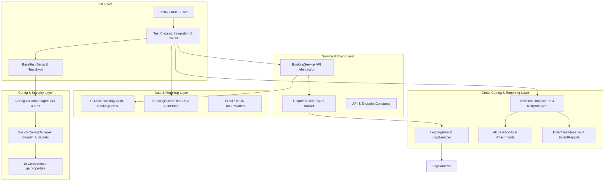

# Framework Architecture & Design Guide

## 1. Architectural Overview

The framework is a modular, multi-layered API automation testing solution built on Java 21 LTS (`--release 21`), REST Assured, TestNG, and Maven. It is verified across contemporary LTS runtimes (tested with JDK 21 and JDK 25), and follows strict separation of concerns, decoupling test logic from HTTP communication, authentication, configuration, data generation, and reporting.



---

## 2. Core Architectural Layers

### 2.1 Service Layer (`com.prasad_v.services`)
* **`BookingService`**: Encapsulates all domain-specific HTTP endpoints (`createBooking`, `getBooking`, `updateBooking`, `partialUpdateBooking`, `deleteBooking`, `getBookingIds`).
* **Isolation**: Tests do not write raw REST Assured queries or manually assemble URLs. They interact with high-level service methods returning typed `Response` objects or deserialized POJOs.
* **Benefits**: If an API endpoint or payload structure changes, updates are localized to the service class rather than across dozens of test methods.

### 2.2 Core Communication & Request Specification (`com.prasad_v.core`)
* **`RequestBuilder`**: Uses the Builder pattern to construct standard `RequestSpecification` instances with pre-configured Base URI, content types, headers, authorization, query/path parameters, and custom filters.
* **`API` & `Endpoint`**: Central repository for base paths, paths, and resource URIs (`/booking`, `/auth`, `/ping`), eliminating hardcoded strings.
* **`LoggingFilter`**: Intercepts outgoing requests and incoming responses, logging payloads via Log4j2 while routing through `LogSanitizer` to prevent sensitive credentials or PII leaks.

### 2.3 Base Test Lifecycle (`com.prasad_v.tests.base.BaseTest`)
* **Thread-Safe Specs**: Manages thread-local `RequestSpecification` so parallel test classes execute in complete isolation without state leakage.
* **Service Instantiation**: Provides access to pre-configured `BookingService` instances across all extending tests.
* **Authentication Helper (`getToken`)**: Issues dynamic token requests using isolated, single-use `RequestSpecification` instances without mutating the shared test specification.

### 2.4 Configuration & Security (`com.prasad_v.config`)
* **`ConfigurationManager`**: Loads environment properties with a hierarchical precedence:
  1. CLI System Properties (`-Dkey=value`)
  2. Operating System Environment Variables (`KEY=VALUE`)
  3. Environment properties files (`src/test/resources/config/<env>.properties`)
* **`SecureConfigManager`**: Handles credential retrieval and supports explicit encoded secrets using the `base64:` prefix without corrupting standard plaintext strings.

### 2.5 Data Modeling & Builders (`com.prasad_v.models` / `com.prasad_v.builders`)
* **Lombok & Jackson POJOs**: Strong type definitions for `AuthPayload`, `TokenResponse`, `Booking`, `BookingResponse`, and `BookingDates`.
* **`BookingBuilder`**: Generates randomized, realistic mock test data on demand using Java Faker, ensuring tests avoid data collision under parallel execution.

### 2.6 Listeners, Interceptors & Reporting (`com.prasad_v.listeners` / `com.prasad_v.reporting`)
* **`TestExecutionListener`**: Implements TestNG's `ITestListener` to automatically capture test start, success, failure, and skip events.
* **Sanitized Attachments**: On test failure, attaches sanitized request, response, and stack traces to Allure without exposing tokens or secrets.
* **`ExtentTestManager`**: Uses `ThreadLocal<ExtentTest>` to ensure ExtentReports test nodes are thread-safe during multi-threaded execution.
* **`RetryAnalyzer`**: Supports automatic re-execution of transiently failing tests.

---

## 3. Design Patterns Employed

| Pattern | Implementation Class | Purpose |
| :--- | :--- | :--- |
| **Builder** | `RequestBuilder`, `BookingBuilder` | Fluent, clean instantiation of complex HTTP requests and test payloads. |
| **Service Layer** | `BookingService`, `UserService`, `BaseApiService` | Decouples test assertions from underlying HTTP transport logic. |
| **Factory** | `AuthenticationFactory` | Encapsulates construction of Basic, OAuth, Bearer token, and API key auth handlers. |
| **Singleton / Static Manager** | `ConfigurationManager`, `ExtentTestManager`, `EnvironmentManager` | Centralized, thread-safe configuration and report lifecycle management. |
| **Template Method** | `BaseTest` | Standardizes setup (`@BeforeSuite`, `@BeforeMethod`), teardown, and context management. |
| **Observer** | `TestExecutionListener` | Listens to TestNG lifecycle events to trigger logging, sanitization, and report updates. |
| **Interceptor / Filter** | `RequestResponseInterceptor`, `LogSanitizer` | Hooks into REST Assured execution pipeline to sanitize and log payloads. |

---

## 4. Package Structure

```
src
├── main
│   ├── java/com/prasad_v
│   │   ├── auth/                # AuthenticationFactory, OAuthHandler, TokenManager
│   │   ├── builders/            # BookingBuilder payload generator
│   │   ├── config/              # ConfigurationManager, SecureConfigManager, EnvironmentManager
│   │   ├── constants/           # Framework constants & APIConstants
│   │   ├── enums/               # RequestType, Environment enums
│   │   ├── interceptors/        # RequestResponseInterceptor, LogSanitizer
│   │   ├── listeners/           # TestExecutionListener
│   │   ├── logging/             # CustomLogger & LogSanitizer integration
│   │   ├── mock/                # MockServerManager, RequestStubber
│   │   ├── modules/             # PayloadManager JSON serialization
│   │   ├── pojos/               # Jackson POJOs (Booking, Auth, TokenResponse)
│   │   ├── reporting/           # ExtentReportManager, ExtentTestManager
│   │   ├── requestbuilder/      # RequestBuilder, HeaderManager, AuthenticationManager
│   │   ├── retry/               # RetryAnalyzer, RetryListener
│   │   ├── services/            # BaseApiService, BookingService, UserService
│   │   ├── testdata/            # ExcelDataProvider, JsonDataProvider
│   │   ├── utils/               # RestUtils, AllureManager, DateUtils, ThreadSafeManager
│   │   └── validation/          # ResponseValidator, SchemaValidator, ResponseTimeValidator
│   └── resources/
│       └── log4j2.xml           # Logging configuration
└── test
    ├── java/com/prasad_v
    │   ├── asserts/             # AssertActions custom assertions
    │   └── tests
    │       ├── api/             # ProductAPITests, UserAPITests
    │       ├── base/            # BaseTest setup and shared helpers
    │       ├── crud/            # TestCreateBooking, TestCreateToken, TestHealthCheck
    │       ├── integration/     # TestE2EFlow_01, TestE2EFlow_02, E2ETest_Assignment1-4
    │       ├── sample/          # TestIntegrationSample, RetryListenerVerificationTest
    │       └── security/        # SecurityTests (Authorization boundaries & LogSanitizer tests)
    └── resources/
        ├── config/              # dev.properties, qa.properties, staging.properties, prod.properties
        ├── schemas/             # JSON Schema files (booking-schema.json, user-schema.json)
        └── testdata/            # Excel & JSON test data files
```
