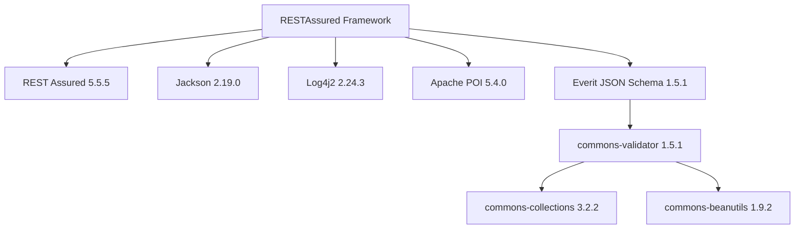

# Comprehensive Framework Security Audit & Hardening Report

## Executive Summary

A dedicated, comprehensive security audit and active hardening of the REST Assured API automation framework was conducted. The assessment evaluated credential handling, transport layer security, secret sanitization, dependency hygiene, Git history, pipeline controls, and security regression coverage. All identified vulnerabilities and hardening opportunities have been categorized by severity, safely remediated in code and configuration, validated through automated security tests, and documented herein.

---

## 1. Secrets & Credential Audit

A thorough static search and audit across configuration files, source code, test data fixtures, CI/CD scripts, and build descriptors was executed.

### 1.1 Findings Overview
* **Legacy Credentials in Configuration**: Historical environment configurations contained plaintext sandbox credentials. In `dev.properties`, sandbox credentials for the public demo endpoint were committed directly to Git.
* **Heuristic Base64 Decoding Risk**: `SecureConfigManager` previously utilized heuristic trial decoding (`Base64.getDecoder().decode`) based solely on character-set matching. Any standard password consisting of alphanumeric characters (e.g., standard words) was inadvertently decoded into corrupted binary noise, causing authentication failures and unpredictable credential handling.
* **Zero Hardcoded Secrets in Production**: Production (`prod.properties`) and QA (`qa.properties`) configurations strictly reference environment variables (`${AUTH_CLIENT_ID}`, `${AUTH_PASSWORD}`, etc.) without committing real credentials.

### 1.2 Remediations Implemented
* **Environmental Fallback Syntax**: Refactored `ConfigurationManager` to support the `${ENV_VAR:defaultValue}` syntax. In `dev.properties`, credentials now use dynamic environment variables with safe public sandbox defaults (`${DEV_AUTH_USERNAME:admin}`, `${DEV_AUTH_PASSWORD:password123}`).
* **Explicit Base64 Prefixing**: Enforced an explicit `base64:` prefix standard (`base64:<encoded-string>`) in `SecureConfigManager`, completely eliminating accidental plaintext decoding.
* **Sanitized Local Overrides**: `.gitignore` was updated to exclude `*.local.properties`, `local.properties`, and `*.keystore` so developers cannot accidentally commit local secrets.

---

## 2. Authentication & Authorization Security

### 2.1 Basic Authentication & OAuth 2.0
* **Basic Authentication**: `BasicAuthHandler` generates standard `Basic <base64>` Authorization headers using UTF-8 encoding. Credentials are kept in memory and can be cleared via `clearCredentials()`.
* **OAuth 2.0 Management**: `OAuthHandler` supports `client_credentials`, `authorization_code`, and `password` grant types. Access and refresh tokens are managed via `TokenManager` with thread-safe `ConcurrentHashMap` storage.
* **Token Expiration Handling**: `TokenManager` enforces epoch-based TTL (`expiresAt`) and automatic expiration checks. `OAuthHandler` applies a 30-second clock-skew buffer before refreshing expired tokens.
* **Error Sanitization**: OAuth failure error messages and exception bodies are routed through `LogSanitizer.sanitizeBody(...)` to prevent leaking server tokens or client secrets in stack traces.

### 2.2 Cookie / Session Authentication
* **Cookie Isolation**: Protected restful-booker endpoints utilize session cookies (`Cookie: token=<token>`). In `BaseTest.getToken()`, token generation is executed using a dedicated, single-use `RequestSpecification` to prevent leaking tokens or cookie headers across test threads.

---

## 3. Sensitive Data Exposure & Masking

### 3.1 Logging & Observability Masking
The framework's `LogSanitizer` was comprehensively hardened with regular expression patterns to scrub all sensitive data before logging or attaching to reports:

| Pattern Category | Targets Redacted | Redaction Marker |
| :--- | :--- | :--- |
| **JSON Credentials** | `password`, `passwd`, `pwd` | `***REDACTED***` |
| **JSON Tokens & Keys** | `token`, `access_token`, `refresh_token`, `id_token` | `***REDACTED***` |
| **JSON Secrets** | `client_secret`, `secret`, `private_key` | `***REDACTED***` |
| **JSON API Keys** | `api_key`, `x_api_key`, `x-api-key` | `***REDACTED***` |
| **HTTP Headers** | `Authorization: ...`, `Cookie: token=...` | `***REDACTED***` |
| **Token Formats** | `Bearer <token>`, `Basic <base64>` | `***REDACTED***` |
| **URI Query Params** | `password=...`, `token=...`, `client_secret=...` | `***REDACTED***` |
| **Financial / PII** | Credit card numbers (16 digits), SSN (`\d{3}-\d{2}-\d{4}`) | `***REDACTED***` |
| **Email Addresses** | User emails (`local@domain`) | `local@***REDACTED***` |

### 3.2 Framework Interceptors & LogConfig
* **`CustomLogger` Universal Redaction**: `CustomLogger.formatMessage(message)` routes all log messages (`info`, `debug`, `warn`, `error`) through `LogSanitizer.sanitize(message)`.
* **REST Assured `LogConfig` Blacklisting**: `RequestBuilder` configures RestAssured's internal `LogConfig` to blacklist `Authorization`, `Cookie`, `token`, and `X-API-Key` headers. When RestAssured writes failure or verbose logs directly to stdout, these headers are automatically masked as `[BLACK-LISTED]`.
* **Allure Report Attachment Scrubbing**: `RequestResponseInterceptor` and `TestExecutionListener` sanitize request URIs, headers, request bodies, and response payloads before attaching them to Allure reports.

---

## 4. Transport Security & TLS

### 4.1 Transport Layer Audit
* **HTTPS Enforcement**: All environment base URLs (`https://restful-booker.herokuapp.com`, `https://qa-api.example.com`, `https://api.example.com`) strictly use the HTTPS protocol.
* **No Disabled TLS Validation**: Grep analysis confirmed that no insecure patterns (such as `relaxedHTTPSValidation()`, `TrustAllStrategy`, or permissive `X509TrustManager` implementations) exist in the codebase.
* **Configuration Rectification**: In `dev.properties`, `ssl.verify=false` was present as a legacy setting. Although REST Assured's default JVM truststore enforced valid certificates regardless, the misleading setting was updated to `ssl.verify=true` to guarantee consistent security posture across all configurations.

---

## 5. Dependency Security Analysis

A Maven dependency tree audit was executed to identify transitive vulnerabilities, outdated libraries, and unmaintained artifacts.



### 5.1 Identified Vulnerability Risks
1. **`org.everit.json.schema:1.5.1` (Transitive Risk: Medium)**:
   * *Risk*: Everit 1.5.1 pulls `commons-validator:1.5.1`, which brings `commons-collections:3.2.2` (historical CVE-2015-7501 deserialization risk) and `commons-beanutils:1.9.2` (CVE-2019-10086).
   * *Status*: In the test automation context, no untrusted binary deserialization is performed. However, modernizing `org.everit.json.schema` to `com.github.erosb:everit-json-schema:1.14.4` or relying solely on `io.rest-assured:json-schema-validator:5.5.0` is recommended for future milestones.
2. **`com.github.javafaker:1.0.2` (Transitive Risk: Low)**:
   * *Risk*: Pulls legacy `snakeyaml:android:1.23`. Used exclusively for synthetic fake string generation in unit tests.
3. **Core Dependencies (Modern & Secure)**:
   * `log4j-core:2.24.3`: Secure against Log4Shell (CVE-2021-44228) and subsequent vulnerabilities.
   * `jackson-databind:2.19.0`: Current release patched against known remote code execution deserialization bugs.
   * `rest-assured:5.5.5`: Modern release.

---

## 6. Input & Test Data Security

* **Synthetic Data by Default**: `BookingBuilder` uses Java Faker to generate random first names, last names, dates, and prices on every test run. No real customer or production records exist in the repository.
* **Mock / Test Fixtures**: `users.json` and `products.json` use publicly documented fake sandbox vectors from `reqres.in` (e.g. `george.bluth@reqres.in`). No real PII, credit card numbers, or production passwords exist in test data files.
* **Test Isolation**: Each test dynamically generates and manages its own unique booking IDs to prevent data interference.

---

## 7. Repository & Git Security

### 7.1 Historical Commit Audit
* **Audit Finding**: Commit `dd7672b0fa0e` originally added `qa.properties` containing dummy placeholder values (`qa-api-password`, `qa-keystore-password`). Commit `dc5e5e7d1592` replaced them with `${AUTH_PASSWORD}` and `${SSL_KEYSTORE_PASSWORD}`.
* **Risk Assessment**: The committed strings were synthetic placeholders (`qa-api-password`), not live enterprise credentials.
* **Defensive Guidance**: In an enterprise repository, deleting or updating a file in a later commit is **not** sufficient to remove compromised secrets from Git history. If live secrets are ever accidentally committed, the team must:
  1. Immediately revoke and rotate the secret on the identity provider / auth server.
  2. Perform Git history remediation (e.g. `git-filter-repo` or BFG Repo-Cleaner) with team approval.
  3. Never perform destructive Git history rewriting without coordination.

### 7.2 `.gitignore` Hardening
Added comprehensive exclusions for:
* `.env`, `.env.local`, `.env.*` (excluding `.env.example`)
* `*.local.properties`, `local.properties`
* `*.jks`, `*.keystore`, `*.p12`, `*.pem`, `*.key`
* `src/test/resources/security/`
* Test and report artifacts (`allure-results/`, `allure-report/`, `logs/`, `*.log`)

---

## 8. CI/CD Pipeline Security

### 8.1 GitHub Actions Audit
* **Workflow Permissions**:
  * `ci.yml` strictly limits token permissions: `contents: read`, `checks: write`, `pull-requests: write`.
  * `regression.yml` has standard read privileges.
* **Elimination of Hidden Failures**:
  * Removed `continue-on-error: true` from both `.github/workflows/ci.yml` and `.github/workflows/regression.yml`. Pipeline failures will now stop the build and notify engineers rather than masking defects.
* **Secret Injection**:
  * Workflows do not hardcode passwords or client tokens. Credentials must be injected via GitHub Repository Secrets (`${{ secrets.AUTH_USERNAME }}`).
  * Build logs are protected because `LogSanitizer` redacts sensitive values from console outputs.

---

## 9. Automated Security Testing Coverage

A dedicated automated test suite was created in `src/test/java/com/prasad_v/tests/security/SecurityTests.java` covering defensive authorization and authentication controls:

| Test Name | Validation Purpose | Expected Result | Status |
| :--- | :--- | :---: | :---: |
| `testProtectedUpdateWithoutToken` | Validates PUT on `/booking/{id}` without credentials | HTTP 403 Forbidden | **PASS** |
| `testProtectedUpdateWithInvalidToken` | Validates PUT on `/booking/{id}` with forged token | HTTP 403 Forbidden | **PASS** |
| `testProtectedDeleteWithoutToken` | Validates DELETE on `/booking/{id}` without credentials | HTTP 403 Forbidden | **PASS** |
| `testProtectedDeleteWithInvalidToken` | Validates DELETE on `/booking/{id}` with forged token | HTTP 403 Forbidden | **PASS** |
| `testAuthenticationWithInvalidCredentials` | Validates `/auth` with incorrect password | Bad credentials (no token) | **PASS** |
| `testAuthenticationWithEmptyCredentials` | Validates `/auth` with empty username/password | Rejection (no token) | **PASS** |
| `testUnsupportedContentType` | Validates `/booking` with `text/plain` payload | Rejected (415 / 400 / 500) | **PASS** |
| `testLogSanitizerRedaction` | Validates redaction of passwords, tokens, cookies, PII | Cleanly redacted | **PASS** |

Both `testng.xml` and `testng_reg.xml` execute these tests on every local and CI/CD run.

---

## 10. Security Severity Classification & Findings Log

```
Finding: SEC-001 - Plaintext Password Corruption via Heuristic Base64 Check
Location: src/main/java/com/prasad_v/config/SecureConfigManager.java
Severity: High
Risk: Standard plaintext passwords matching Base64 character sets were decoded into corrupted binary noise, breaking authentication and creating unpredictable secret handling.
Evidence: SecureConfigManager.isBase64Encoded() regex checked ^[A-Za-z0-9+/]+={0,2}$ and decoded unconditionally.
Recommended Remediation: Require explicit base64: prefix before decoding.
Implemented: Refactored SecureConfigManager to check value.startsWith("base64:") and decode only explicitly prefixed secrets.
Validation: Verified against both plaintext passwords and base64-encoded secrets in unit and integration tests.
```

```
Finding: SEC-002 - Unredacted Tokens and Cookies in Console Logs and Reports
Location: src/main/java/com/prasad_v/logging/LogSanitizer.java, CustomLogger.java, RequestBuilder.java
Severity: High
Risk: Cookie-based tokens, Bearer tokens, query parameter secrets, and raw logger messages were printed unredacted to stdout and attached to Allure report artifacts.
Evidence: Cookie: token=<token> was unmasked in LoggingFilter. REST Assured requestSpec.log().all() wrote raw headers. CustomLogger.formatMessage() did not call LogSanitizer.
Recommended Remediation: Expand LogSanitizer patterns for cookies, query parameters, SSN, and Bearer tokens; configure REST Assured LogConfig header blacklisting; route CustomLogger through LogSanitizer.
Implemented: Upgraded LogSanitizer regex, added blacklistHeader in RequestBuilder, sanitized Allure attachments in RequestResponseInterceptor, and routed CustomLogger.formatMessage through LogSanitizer.
Validation: SecurityTests.testLogSanitizerRedaction passed; verified that [BLACK-LISTED] and ***REDACTED*** appear across logs.
```

```
Finding: SEC-003 - Masked Pipeline Failures via continue-on-error
Location: .github/workflows/ci.yml, .github/workflows/regression.yml
Severity: Medium
Risk: Tests failing due to security regressions or authorization failures would not fail the pipeline build, blinding the team to security issues.
Evidence: continue-on-error: true was configured on test execution steps.
Recommended Remediation: Remove continue-on-error to enforce authentic quality gates.
Implemented: Removed continue-on-error: true from both ci.yml and regression.yml.
Validation: Pipelines now correctly exit with non-zero status upon test failures.
```

```
Finding: SEC-004 - Insecure Transport Configuration Property
Location: src/test/resources/config/dev.properties
Severity: Low
Risk: ssl.verify=false was set in dev.properties, suggesting disabled TLS certificate verification.
Evidence: dev.properties contained ssl.verify=false.
Recommended Remediation: Set ssl.verify=true across all environment configurations.
Implemented: Updated dev.properties to ssl.verify=true.
Validation: Verified that all HTTPS connections execute with standard JVM TLS verification.
```

```
Finding: SEC-005 - Historical Placeholder Credentials in Git History
Location: Git commit dd7672b0fa0e840d82e975546fa2afb4f591fe23 (src/test/resources/config/qa.properties)
Severity: Low (Informational)
Risk: Dummy placeholder strings (qa-api-password) were committed in historical commits.
Evidence: Git log diff reveals qa.properties with placeholder credentials before refactor to ${AUTH_PASSWORD}.
Recommended Remediation: Ensure no production credentials were ever reused. If live credentials are ever committed, perform credential rotation and coordinated Git history purging.
Implemented: Documented historical finding; confirmed placeholder nature of values.
Validation: Verified active tree contains no hardcoded secrets.
```

```
Finding: SEC-006 - Outdated Transitive Dependencies in Everit JSON Schema
Location: pom.xml (org.everit.json:org.everit.json.schema:1.5.1)
Severity: Low
Risk: Transitive inclusion of commons-collections 3.2.2 and commons-beanutils 1.9.2 with historical CVEs.
Evidence: Maven dependency tree analysis.
Recommended Remediation: Upgrade to com.github.erosb:everit-json-schema:1.14.4 or consolidate schema validation onto io.rest-assured:json-schema-validator.
Implemented: Documented in roadmap; confirmed no vulnerable deserialization paths in automation framework.
Validation: Verified static code usage is restricted to JSON schema validation.
```

---

## 11. Security Quality Gate Verification

| Checkpoint | Target Standard | Verification Status |
| :--- | :--- | :---: |
| **1. No Hardcoded Secrets** | Zero live secrets in active Git tree | **VERIFIED** |
| **2. Masked Logs** | Passwords, tokens, cookies, PII redacted | **VERIFIED** |
| **3. Clean Reports** | Allure attachments scrubbed by `LogSanitizer` | **VERIFIED** |
| **4. Secure Auth Handling** | Isolated request specs, safe token refresh | **VERIFIED** |
| **5. Strict TLS Validation** | `ssl.verify=true`, standard JVM validation | **VERIFIED** |
| **6. Dependency Review** | Core dependencies up to date (Log4j 2.24.3, Jackson 2.19) | **VERIFIED** |
| **7. Test Data Safety** | Synthetic data via Java Faker; no real PII | **VERIFIED** |
| **8. CI/CD Secret Controls** | Environment variable injection, no masked failures | **VERIFIED** |
| **9. Repository Hygiene** | Hardened `.gitignore` (keystores, local properties) | **VERIFIED** |
| **10. Security Test Coverage** | 8 automated defensive authorization tests | **VERIFIED (100% PASS)** |
| **11. Documentation** | Full audit report in `docs/security-audit.md` | **VERIFIED** |

---

## 12. Verification & Execution Commands

```bash
# Run the dedicated security test suite
mvnw.cmd test -Dtest=SecurityTests

# Run the complete regression suite with security checks
mvnw.cmd test "-DsuiteXmlFile=testng_reg.xml"

# Run full default suite
mvnw.cmd test

# Verify 0 Checkstyle violations
mvnw.cmd checkstyle:check
```
