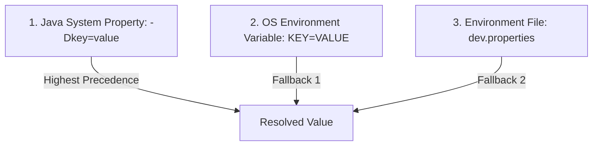

# Security & Secret Management Guide

## 1. Security Architecture & Principles

Test automation frameworks frequently interact with sensitive systems, including authentication tokens, API keys, basic auth credentials, and customer test records. The framework enforces strict security controls:
1. **Zero Plaintext Secrets in Source Control**: Production and sensitive environment secrets must never be committed to Git.
2. **Explicit Secret Encoding**: Support for pre-encoded secrets using an explicit prefix scheme (`base64:`) rather than fragile heuristic guessing.
3. **Automated Log & Report Sanitization**: Sensitive keys in headers, query parameters, request bodies, response payloads, and exception attachments are automatically masked.
4. **Hierarchical Credential Precedence**: Dynamic runtime overrides via CLI or CI/CD environment variables supersede local property files.

---

## 2. Credential Resolution Precedence

When `SecureConfigManager` or `ConfigurationManager` retrieves a configuration property (such as `api.username`, `api.password`, or `api.token`), values are resolved in the following priority order:



1. **CLI System Property (`System.getProperty`)**: Explicitly passed via command line (e.g., `-Dapi.password=...`).
2. **Operating System Environment Variable (`System.getenv`)**: Injected by CI/CD runner secrets (e.g., GitHub Actions `AUTH_PASSWORD`).
3. **Environment Properties File**: Fallback values stored in `src/test/resources/config/<env>.properties`.

---

## 3. Explicit Base64 Secret Support

### The Heuristic Decoding Problem
Previous implementations attempted to detect Base64 by checking regex `^[A-Za-z0-9+/]+={0,2}$` and attempting a trial decode. However, common standard plaintext passwords (such as `"pass"`, `"admin123"`, `"secret"`) match this regex and were mistakenly decoded into corrupted binary garbage, breaking authentication.

### The Explicit Prefix Solution
The framework requires the prefix `base64:` for any Base64-encoded secret:

```properties
# src/test/resources/config/staging.properties
api.password=base64:cGFzc3dvcmQxMjM=
```

When `SecureConfigManager.getDecryptedProperty(key)` detects the `base64:` prefix:
1. It strips the `base64:` marker.
2. Decodes the remaining Base64 characters into the original plaintext secret.
3. Returns the decoded string safely for authentication requests.
4. If no prefix is present, it returns the value as a standard plaintext string.

---

## 4. Log & Report Sanitization

### 4.1 Filter Redaction (`LogSanitizer`)
All network communication captured by `LoggingFilter` passes through `LogSanitizer` before logging to console or file:

* **Sensitive Headers Masked**:
  * `Authorization`
  * `Cookie`
  * `X-API-Key`
  * `token`
* **Sensitive JSON / Body Keys Masked**:
  * `password`, `token`, `secret`, `accessToken`, `refreshToken`, `client_secret`
  * Credit card patterns (e.g., `\\b\\d{4}[- ]?\\d{4}[- ]?\\d{4}[- ]?\\d{4}\\b`)
  * Email patterns and bearer tokens (`Bearer [a-zA-Z0-9._-]+`)

All matching values are replaced with `[REDACTED]`.

### 4.2 Listener Redaction (`TestExecutionListener`)
When an assertion fails, `TestExecutionListener` captures the response for Allure report attachment:
* The response body is passed through `LogSanitizer.sanitizeBody(body)` before being written to the Allure lifecycle context.
* This guarantees that failure artifacts do not accidentally leak session tokens, API keys, or customer PII in report dashboards.

---

## 5. Recommended CI/CD Secret Configuration

In GitHub Actions or Jenkins:
* Store credentials in repository or project secrets:
  * `AUTH_USERNAME`
  * `AUTH_PASSWORD`
* Inject them directly into Maven test commands:
```bash
mvnw.cmd test -Dapi.username="${AUTH_USERNAME}" -Dapi.password="${AUTH_PASSWORD}"
```
Do not echo these variables into pipeline build logs.
